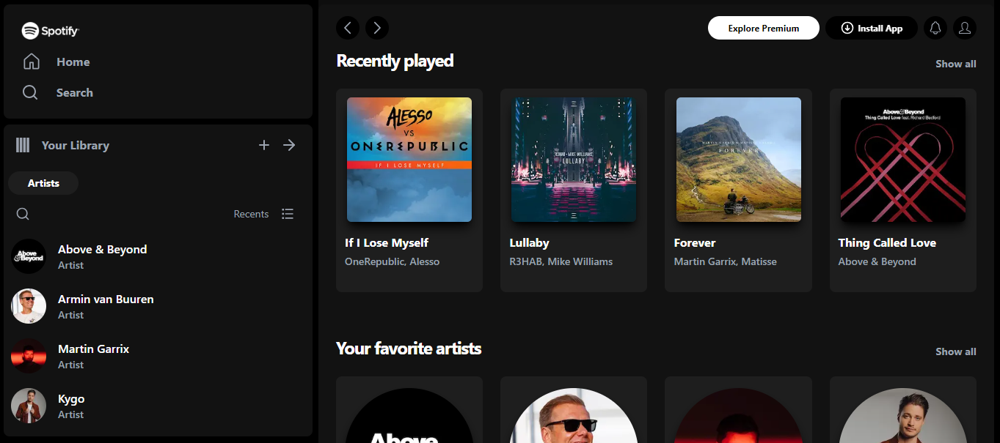

# Welcome! 👋

# Spotify Clone Page

This is a Clone Page.  

## Table of contents

- [Overview](#overview)
  - [The challenge](#the-challenge)
  - [Screenshot](#screenshot)
  - [Links](#links)
- [My process](#my-process)
  - [Built with](#built-with)
  - [What I learned](#what-i-learned)
  - [Continued development](#continued-development)
- [Author](#author)

## Overview

### The challenge

Users should be able to:

- View the optimal layout for the site depending on their device's screen size
- See hover states for all interactive elements on the page

### Screenshot



### Links

- Live Site URL: [easybank_landing_page](https://liwgar.github.io/easybank_landing_page/)

## My process

This is a [Next.js](https://nextjs.org/) project bootstrapped with [`create-next-app`](https://github.com/vercel/next.js/tree/canary/packages/create-next-app).

## Getting Started

First, run the development server:

```bash
npm run dev
# or
yarn dev
# or
pnpm dev
# or
bun dev
```

### Built with

- Git & Github.
- NPM.
- React.js
- Next.js
- Flexbox.
- Grid.
- JavaScript.
- [Styled Components](https://styled-components.com/) - For styles
- Desktop-first workflow.

### What I learned

- Apply responsive design for any device.
- Apply flexbox and grid with TailwindCSS.
- Components.
- use Link, Image, useState. 

### Continued development

The objective is:
- Improve the practice of styles with flexbox and grid.
- Increase knowledge in React.JS.

## Author

- Website - [LiwGAr](https://liwgar-portfolio.vercel.app/)

I've just completed a front-end coding! 🎉


Any suggestions on how I can improve are welcome!
